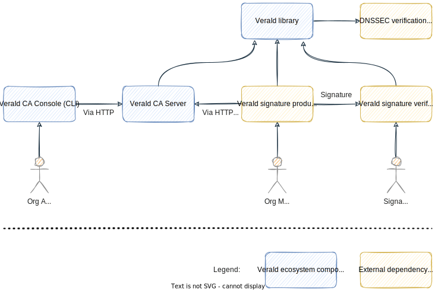

# Vera Architecture (MVP)

This document describes the systems and software architecture of the various component that will make up the Minimum Viable Product (MVP) version of Vera.

## Vera library

This library, available in JavaScript and JVM/Android, will implement all the cryptographic and data serialisation operations needed by the various components in Vera.

Its JS version will use PKI.js, ASN1.js and a new DNSSEC verification library to be implemented by Relaycorp. Its JVM/Android version will use Bouncy Castle and ideally dnsjava ([if we can expose the DNSSEC verification interface](https://github.com/dnsjava/dnsjava/issues/255) -- otherwise we'll have to implement our own DNSSEC verification library).

Prototype implementation: [`vera-lib`](https://github.com/VeraDomains/poc/tree/main/vera-lib).

## Vera Certificate Authority (CA) server

This multi-tenant server will allow one or more organisations to manage their Vera setup, and it'll also allow organisation members to claim and renew their Vera Ids.

It will support the following API endpoints, which are to be consumed by the Vera CA Console (used by organisation admins) and Vera signature producers (used by organisation members):

- `POST /zones/`: Create zone.
  - Auth: OAuth2 (_admin_).
  - Input:
    - Zone (e.g., `acme.com`).
    - Access type (invite-only or open).
    - Services (e.g., Letro).
    - [Awala endpoint middleware](https://github.com/relaycorp/relayverse/issues/28) URL (optional).
  - Output: TXT record.
- `DELETE /zones/{zone}/`: Delete zone.
  - Auth: OAuth2 (_zone admin_).
- `POST /zones/{zone}/user-invites/`: Create user invite, if access type is invite-only.
  - Auth: OAuth2 (_zone admin_).
  - Input: Username and service id.
  - Output: Single-use claim token.
- `POST /zones/{zone}/users/`*: Claim invite and request Vera Id, if access type is invite-only.
  - Auth: Single-use claim token.
  - Input: Vera Id public key.
  - Output: Vera Id certificate.
- `POST /zones/{zone}/users/{user}/ids/`*: Renew Vera Id.
  - Auth: Signed request with the asymmetric key in the Vera Id.
  - Input: None.
  - Output: New Vera Id certificate.
- `DELETE /zones/{zone}/users/{user}/`: Delete user.
  - Auth: OAuth2 (_zone admin_).
- `POST /zones/{zone}/awala/`: [Awala endpoint middleware](https://github.com/relaycorp/relayverse/issues/28) backend.
  - Auth: Awala Endpoint Middleware.
  - Awala service messages:
    - `UserInviteClaim` (if access type is invite-only).
      - Input: Single-use claim token.
      - Output: Vera Id certificate.
    - `UserIdRequest` (if access type is open).
      - Input: Vera Id public key and desired username.
      - Output: Vera Id certificate.
    - `UserIdRenewal`.
      - Input: Username, signed with asymmetric key in the Vera Id.
      - Output: New Vera Id certificate.

\* We may skip this endpoint in v1 because the endpoint `POST /zones/{zone}/awala/` already supports this functionality.

This server will have the following background processes:

- [Awala endpoint middleware](https://github.com/relaycorp/relayverse/issues/28) backend. Used to respond to the requests made to `POST /zones/{zone}/awala/`.

Prototype implementation: [`vera-ca`](https://github.com/VeraDomains/poc/tree/main/vera-ca).

## Vera CA Console

This will be the command-line interface (CLI) to the admin-only endpoints in the Vera CA Server.

The admin user will have to log in using [device authorisation code](https://auth0.com/docs/get-started/authentication-and-authorization-flow/device-authorization-flow), ideally.

Prototype implementation: [`vera-ca` (`tech.relaycorp.vera.ca.cli.Main`)](https://github.com/VeraDomains/poc/blob/main/vera-ca/src/main/java/tech/relaycorp/vera/ca/cli/Main.kt).

## Notable compromises

We're taking the following shortcuts to keep the cost of the MVP down:

- The Vera CA Console is to be implemented as a CLI.
- No way for organisation users to claim their ids without admin intervention.
- No support for bot accounts as organisation members.
