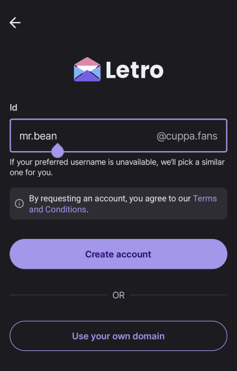
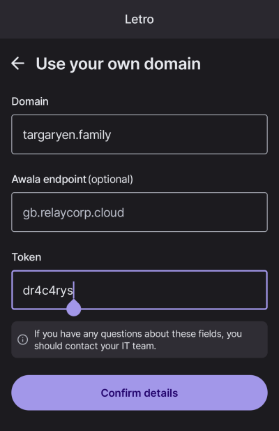

# How to use VeraId

Using VeraId is--we hope--very easy!

## Verify signatures

To verify VeraId signatures, there's absolutely no user interaction needed.
All you need is an app implementing a [VeraId service](/services)!

## Produce signatures

To _produce_ VeraId signatures,
you just need to follow the instructions from your VeraId-compatible app.
Every app will handle this differently.

For example,
[Letro](https://letro.app/en/) offers the ability to get free identifiers from domains such as `applepie.rocks` and `cuppa.fans`,
with minimal configuration as shown in the screenshot below.



Letro also integrates with [VeraId Authority](https://docs.relaycorp.tech/veraid-authority/) to enable users to use their own domain names.
The screenshot below shows what the user should provide to use their own domain name;
this information should be provided by the operator of VeraId Authority, as described below.



After this initial setup,
the app can automatically produce signatures without further user intervention!

## Issue member ids under your own domain name

To enable VeraId for your domain name, you need to:

1. Enable DNSSEC on your domain, if you haven't already. Use [DNSSEC Analyzer](https://dnssec-analyzer.verisignlabs.com/) to verify that your domain is correctly configured.
2. Deploy [VeraId Authority](https://docs.relaycorp.tech/veraid-authority/). (FYI, we will offer a SaaS version. Stay tuned!)
3. Configure your domain name and member(s) in your VeraId Authority instance.
4. Create the necessary `TXT` record.

Once VeraId is enabled for your domain,
you can integrate it with any end user app implementing a VeraId service.
This process depends on how the service uses VeraId,
so you have to refer to the documentation of the service.
For example,
in a service like Letro,
where users are able to produce signatures offline,
you'd need to do the following with each member:

1. Create a member under the organisation in your VeraId Authority instance, if you haven't already.
2. Generate a _public key import token_ for the member on VeraId Authority. This would generate a single-use, pseudorandom string that can be used to import the member's public key (eventually used to issue the member certificate). For security reasons, you must specify the service to which the eventual member certificate will be bound; refer to the documentation of the service to obtain this value.
3. Securely share the import token with the member.
4. Have the member enter the token in their VeraId-compatible app, as shown in the screenshot above. Internally, the app will take care of generating the member's key pair, importing the public key using the token, obtaining the _member id bundle_ (containing the member's certificate) from VeraId Authority, and periodically renewing the bundle.

At the moment, any interaction with VeraId Authority must be done via [the API](https://docs.relaycorp.tech/veraid-authority/api) or [its JS client](https://docs.relaycorp.tech/veraid-authority-js/), but we plan to offer a UI in the future.

Note that, theoretically, the use of VeraId Authority is optional.
We built it to facilitate the operation of VeraId in organisations,
but it is conceivable to use a [VeraId library](/overview#core-libraries) to build a different mechanism to manage VeraId certificates.
For example,
someone could build an Android app to play the role of VeraId Authority without any servers,
which might come in handy for personal use.

```yaml
services:
  veraid-authority:
    image: ghcr.io/relaycorp/veraid-authority:2.4.1
    command: api
    ports:
      - "127.0.0.1:8080:8080"
    environment:
      AUTHORITY_VERSION: "1.0.0dev1"
      AUTHORITY_SUPERADMIN: admin@veraid.example
      MONGODB_URI: mongodb://mongodb/?authSource=admin
      MONGODB_USER: root
      MONGODB_PASSWORD: password123
      MONGODB_DB: endpoint
      OAUTH2_JWKS_URL: http://mock-authz-server:8080/default/jwks
      OAUTH2_TOKEN_AUDIENCE: default
      OAUTH2_TOKEN_ISSUER_REGEX: "^http://[^/]+/default$$"
      KMS_ADAPTER: AWS
      AWS_ACCESS_KEY_ID: access_key_id
      AWS_SECRET_ACCESS_KEY: secret_access_key
      AWS_KMS_ENDPOINT: http://mock-aws-kms:8080
      AWS_KMS_REGION: eu-west-2
    depends_on:
      mongodb:
        condition: service_healthy
      mock-authz-server:
        condition: service_started
      mock-aws-kms:
        condition: service_healthy
  mock-authz-server:
    image: ghcr.io/navikt/mock-oauth2-server:0.5.8
    ports:
      - "127.0.0.1:8081:8080"
    environment:
      JSON_CONFIG: |
        {
          "tokenCallbacks": [
            {
              "issuerId": "default",
              "tokenExpiry": 120,
              "requestMappings": [
                {
                  "requestParam": "scope",
                  "match": "super-admin",
                  "claims": {"email": "admin@veraid.example"}
                }
              ]
            }
          ]
        }
  mock-aws-kms:
    image: nsmithuk/local-kms:3.11.4
    volumes:
      - ./kms-seed.yaml:/init/seed.yaml
    healthcheck:
      test: ["CMD", "sh", "-c", "netstat -an | grep -q ':8080.*LISTEN' || nc -z localhost 8080"]
      interval: 5s
      retries: 3
  mongodb:
    image: mongo:6.0.4
    environment:
      MONGO_INITDB_ROOT_USERNAME: root
      MONGO_INITDB_ROOT_PASSWORD: password123
    healthcheck:
      test: echo 'db.runCommand("ping").ok' | mongosh localhost:27017/test --quiet
      interval: 10s
      timeout: 10s
      retries: 5
      start_period: 40s
```

```
DnssecChain ::= SET OF OCTET STRING
```
